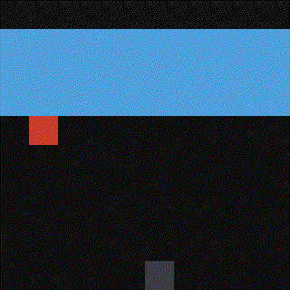
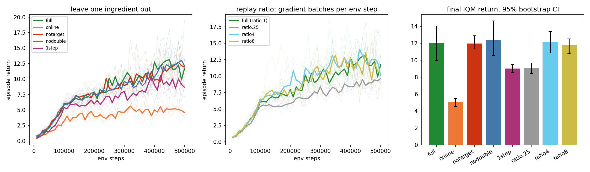

# napkin-replay

Repo 3 of the **[napkin-gamemaster series](https://github.com/arose26/napkin-gamemaster)** ([napkin-returns](https://github.com/arose26/napkin-returns) → [napkin-pixels](https://github.com/arose26/napkin-pixels) → this; the series home has the full index). On-policy, the series found that textbook variance machinery bought ~nothing and **data reuse bought 6×**. DQN is the off-policy version of that bet — and it ships as a bundle: replay buffer, frozen target network, double-Q, n-step returns. Every course teaches the bundle. This repo asks:

> **Which ingredient of the DQN bundle is load-bearing on a small game — and how many gradient steps per environment step before reuse turns toxic?**



## The experiment

MinAtar Breakout (10×10×4 — real Atari mechanics, napkin cost; sticky actions 0.1, so the env is honestly stochastic), one DQN implementation, matched env steps (500k), 5 seeds per recipe, IQM + bootstrap CIs, ties reported as ties (the napkin-returns rule).

| recipe | change |
|---|---|
| `full` | replay 100k + target net + double-Q + 3-step |
| `online` | no buffer — train on the latest 32 transitions |
| `notarget` | target net ≡ online net (double-Q then *provably* collapses to vanilla — `selfcheck` asserts it) |
| `nodouble` | vanilla max target |
| `1step` | 1-step TD |
| `ratio.25` / `ratio4` / `ratio8` | same bundle, 0.25 / 4 / 8 gradient batches per env step (`full` is ratio 1) |

The leave-one-out isolates each ingredient; the ratio arms ask napkin-returns' reuse question in its off-policy form, where reuse is supposed to be the whole point of having a buffer.

## Hypothesis (registered before the sweep ran)

1. **`online` is the catastrophic arm** — correlated minibatches, not missing targets, are what actually breaks DQN. Predict: less than half of `full`'s score.
2. `notarget` hurts clearly but survivably at this scale.
3. `nodouble` changes nothing measurable on MinAtar (overestimation bias needs bigger action spaces / longer horizons to bite).
4. `1step` is modestly worse than 3-step.
5. **Reuse helps until it doesn't:** `ratio4` beats `full` at matched env steps, `ratio8` sits at or below `ratio4` (the knee), `ratio.25` clearly loses. The off-policy echo of napkin-returns' headline.

## Results



| arm | final IQM return (95% CI) | verdict on the hypothesis |
|---|---|---|
| `full` | **12.02** (9.97 – 14.03) | — |
| `online` (no replay) | **5.07** (4.54 – 5.48) | ✓ confirmed: catastrophic, 42% of full (predicted <50%) |
| `notarget` | **11.97** (11.33 – 12.89) | ✗ **refuted**: no detectable effect, not "hurts clearly" |
| `nodouble` | **12.41** (10.57 – 14.66) | ✓ confirmed: nothing measurable |
| `1step` | **9.01** (8.56 – 9.49) | ✓ confirmed: clearly worse (−25%) |
| `ratio.25` | **9.09** (8.45 – 9.66) | ✓ part of #5: starving updates clearly loses |
| `ratio4` | **12.13** (10.87 – 13.40) | ✗ part of #5: ties full, does **not** beat it |
| `ratio8` | **11.81** (10.76 – 12.52) | ✓ part of #5: at/below ratio4 — the knee is real |

**What actually holds DQN together on MinAtar Breakout: the replay buffer, and almost nothing
else.** Removing replay costs 58%. Removing 3-step returns costs 25%. Removing the target
network or double-Q costs *nothing detectable at n=5* — the two most famous stabilizers are
ties here (a scale statement, not a universal one: this is a small net on a 10×10 game with a
50k-transition buffer; the pathologies those fixes target may simply need more room to grow).

**Replay ratio: paying more gradient steps per env step stops buying anything at ratio 1.**
0.25 starves (−24%); 1, 4, and 8 are statistical ties at matched env steps. Sample reuse
saturates far earlier here than the compute budget does — ratio 8 spends 8× the FLOPs of
ratio 1 for the same return.

## Run it

```bash
pip install --target .deps "numpy<2" minatar
PYTHONPATH=.deps python3.10 napkin_replay.py selfcheck   # ~3 min
PYTHONPATH=.deps python3.10 napkin_replay.py sweep       # or 4 parallel shards:
# for i in 0 1 2 3; do PYTHONPATH=.deps python3.10 napkin_replay.py sweep --shard $i --nshards 4 & done
PYTHONPATH=.deps python3.10 napkin_replay.py plot
PYTHONPATH=.deps python3.10 napkin_replay.py gif
```

`selfcheck` asserts: the env scores under random play; replay sampling is uniform (6σ bound); **double-Q ≡ vanilla when the nets are tied** (the degeneracy `notarget` relies on); n-step tuples have hand-checked values, correct partial-flush lengths *m*, and never cross an episode boundary; bootstrapping discounts by γ^m; one fixed batch is overfittable to 1e-15; the ε schedule's endpoints.

## What's deliberately not here

No prioritized replay, no dueling heads, no distributional anything, no Rainbow — those are someone else's six more arms. No evaluation-mode runs (returns are training returns under the decaying ε, identical across recipes). Adam instead of the MinAtar paper's RMSProp: comparisons here are within-repo only.

## Model

Conv 3×3 (16ch) → fc 128 → Q-values (the MinAtar paper's net). γ=0.99, Adam 2.5e-4, batch 32, buffer 100k, warmup 5k, ε 1→0.1 over 100k steps, target sync every 1k steps, 5k-step episode cap flushed as truncation (bootstrapped, not terminal). ~245 env steps/s on an RTX 4050 → ~34 min per 500k-step run.
